## Hi there 👋

<!--
**mw48795472/mw48795472** is a ✨ _special_ ✨ repository because its `README.md` (this file) appears on your GitHub profile.

Here are some ideas to get you started:

- 🔭 I’m currently working on ...
- 🌱 I’m currently learning ...
- 👯 I’m looking to collaborate on ...
- 🤔 I’m looking for help with ...
- 💬 Ask me about ...
- 📫 How to reach me: ...
- 😄 Pronouns: ...
- ⚡ Fun fact: ...
-->

.github/
└── workflows/
    └── stats.yml

name: Update README cards

on:
  schedule:
    - cron: "0 0 * * *"
  workflow_dispatch:

jobs:
  build:
    runs-on: ubuntu-latest

    permissions:
      contents: write

    steps:
      - uses: actions/checkout@v6

      - name: Generate top languages
        uses: stats-organization/github-readme-stats-action@v2
        with:
          card: top-langs
          options: username=mw48795472&layout=compact&langs_count=8
          path: profile/top-langs.svg
          token: ${{ secrets.GITHUB_TOKEN }}

      - name: Commit card
        run: |
          git config user.name "github-actions[bot]"
          git config user.email "41898282+github-actions[bot]@users.noreply.github.com"
          git add profile/top-langs.svg
          git commit -m "Update language stats" || exit 0
          git push

