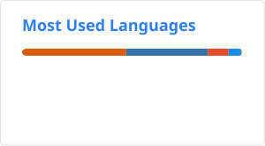
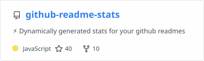

## 🛠️ Tech Stack

| Category | Technology |
| :--- | :--- |
| **Main Language** |    |
| **Other Language** |    |
| **front-end** |  |
| **Back-end** | [Mysql](https://img.shields.io/badge/mysql-4479A1?style=for-the-badge&logo=mysql&logoColor=white) |
| **Design** |      |
| **Infrastructure** |  |
| **Tool/Collaboration** |    |

   
